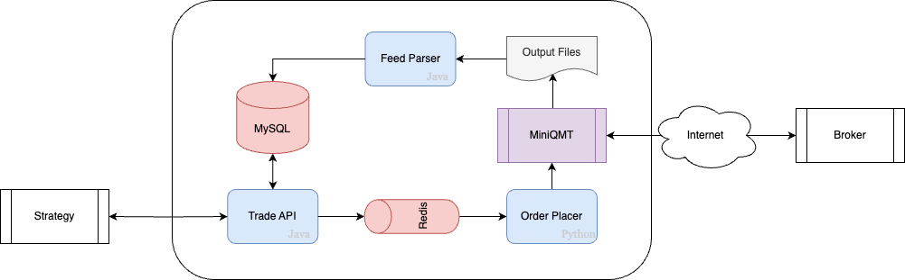

# XtQuantGateway

XtQuantGateway 是对 XtQuant 的 二次封装，成为一个独立的交易网关微服务。使得：

1. 解决了 XtQuant 只能在 Windows 本机使用的局限。
2. 方便查看和统计历史数据。

## 系统结构

1. Trade API

   RESTful接口服务，接收来自外部的下单和查询请求。

2. Order Placer

   将 Trade API 收到的下单请求，通过调用 MiniQMT 提供的 API，提交到 MiniQMT。

3. Feed Parser

   MiniQMT输出文件的数据解析，包括资金，持仓，定单等数据。

由于 MiniQMT 提供的 API，只有 python 版本，并且多线程的情况下不稳定，所以 Trade API 收到下单请求后，

1. 先在MySQL保存定单记录；
2. 将定单记录保存到 Redis 的队列中，使下单请求串行化。

Order Placer 模块监听 Redis 队列，依次取出定单，提交到 MiniQMT。

## 目录结构

* /Document - 文档

* /OrderPlacer

  定单处理模块，使用 Python 开发。 

* /Server

  包含了 Trade API 和 FeedParser 模块，使用 Java(SpringBoot) 开发。
